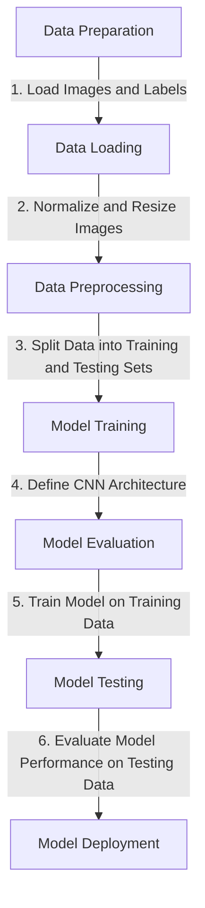

# Automated Plant Species Classification using Convolutional Neural Networks for Agricultural Advancement
## Background and Context
In recent times, the field of agriculture has been in urgent need of modernizing, since the amount of manual work people need to put in to check if plants are growing correctly is still highly extensive. 
Despite several advances in agricultural technology, people working in the agricultural industry still need to have the ability to sort and recognize different plants and weeds, which takes a lot of time and effort in the long term. 
The potential is ripe for this trillion-dollar industry to be greatly impacted by technological innovations that cut down on the requirement for manual labor, and this is where 
Artificial Intelligence can benefit the workers in this field, as the time and energy required to identify plant seedlings will be greatly shortened by the use of AI and Deep Learning. 
The ability to do so far more efficiently and even more effectively than experienced manual labor could lead to better crop yields, the freeing up of human involvement for higher-order agricultural decision making, and
in the long term will result in more sustainable environmental practices in agriculture as well. 
## Objective 
* The Aarhus University Signal Processing group, in collaboration with the University of Southern Denmark, has provided the data containing images of unique plants belonging to 12 different species.
* Build a Convolutional Neural Network model which would classify the plant seedlings into their respective 12 categories.
## Data Description 
This dataset contains images of unique plants belonging to 12 different species. 
The data file names are: images.npy Label.csv Due to the large volume of data, the images were converted to numpy arrays and stored in images.npy file and
the corresponding labels are also put into Labels.csv so that you can work on the data/project seamlessly without having to worry about the high data volume.
## visualization of the approach

